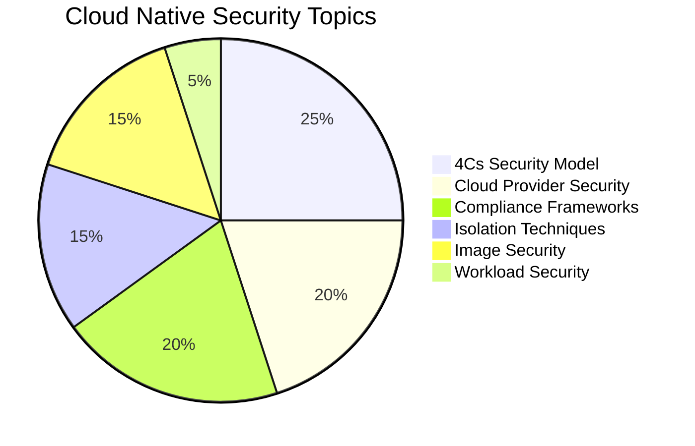

# 🌐 Cloud Native Security Overview - 14%

<div align="center">


**🎯 Foundation Domain - Start Your KCSA Journey Here!**

</div>

---

## 🎯 Domain Overview

> **Cloud Native Security** is the practice of securing cloud native applications and infrastructure throughout their **entire lifecycle** - from development to deployment to runtime.

### 🔍 What You'll Master

This foundational domain covers the **security principles** that underpin all cloud native technologies. Think of it as building your security mindset before diving into specific Kubernetes implementations.

<table>
<tr>
<td width="50%">

#### 🎓 **Learning Objectives**
- Understand the 4Cs security model
- Master shared responsibility concepts
- Learn compliance frameworks
- Implement isolation techniques
- Secure container images and registries
- Apply workload security best practices

</td>
<td width="50%">

#### 🎯 **Exam Focus Areas**
- Security layering principles (4Cs)
- Cloud provider security models
- Compliance requirements (PCI, HIPAA, SOC2)
- Container image security
- Isolation and segmentation
- Security frameworks and tools

</td>
</tr>
</table>

### 📊 Domain Breakdown



---

## 🏗️ The 4Cs of Cloud Native Security

> **🎯 Exam Focus:** This is the foundational model for all cloud native security. Expect 2-3 questions directly on this topic!

The **4Cs model** represents a **layered defense strategy** where each layer builds upon and depends on the security of the layers beneath it. Think of it like an onion - multiple layers of protection!

<div align="center">

```
┌─────────────────────────────────────────┐
│                 ☁️ CLOUD                │  ← Outermost Layer
│  ┌─────────────────────────────────────┐ │
│  │            🏗️ CLUSTER              │ │
│  │  ┌─────────────────────────────────┐ │ │
│  │  │         📦 CONTAINER           │ │ │
│  │  │  ┌─────────────────────────────┐ │ │ │
│  │  │  │        💻 CODE             │ │ │ │  ← Innermost Layer
│  │  │  └─────────────────────────────┘ │ │ │
│  │  └─────────────────────────────────┘ │ │
│  └─────────────────────────────────────┘ │
└─────────────────────────────────────────┘
```

</div>

### 💻 Layer 1: Code (Innermost Layer)

> **🎯 Security starts with secure code!** This is where vulnerabilities are born.

<table>
<tr>
<td width="50%">

#### 🔒 **Security Practices**
- **Secure coding standards** (OWASP guidelines)
- **Dependency vulnerability scanning**
- **Static Application Security Testing (SAST)**
- **Secret management** (never hardcode!)
- **Code signing and integrity**

</td>
<td width="50%">

#### 🛠️ **Tools & Examples**
```bash
# Dependency scanning with npm audit
npm audit --audit-level high

# Secret scanning with git-secrets
git secrets --scan

# SAST with SonarQube
sonar-scanner -Dsonar.projectKey=myapp
```

</td>
</tr>
</table>

#### 📝 **Code Security Example**

```python
# ❌ BAD: Hardcoded secrets
DATABASE_URL = "postgresql://user:password123@db:5432/myapp"

# ✅ GOOD: Environment variables
import os
DATABASE_URL = os.getenv('DATABASE_URL')

# ✅ BETTER: Secret management service
from kubernetes import client, config
def get_secret(name, namespace='default'):
    config.load_incluster_config()
    v1 = client.CoreV1Api()
    secret = v1.read_namespaced_secret(name, namespace)
    return secret.data
```

### 📦 Layer 2: Container

> **🎯 Container security is about image integrity and runtime protection.**

<table>
<tr>
<td width="50%">

#### 🔒 **Security Practices**
- **Minimal base images** (distroless, alpine)
- **Image vulnerability scanning**
- **Image signing and verification**
- **Runtime security monitoring**
- **Non-root user execution**

</td>
<td width="50%">

#### 🛠️ **Tools & Examples**
```bash
# Scan with Trivy
trivy image nginx:latest

# Sign with Cosign
cosign sign --key cosign.key myimage:v1.0

# Verify signature
cosign verify --key cosign.pub myimage:v1.0
```

</td>
</tr>
</table>

#### 📝 **Secure Dockerfile Example**

```dockerfile
# ✅ SECURE Dockerfile
FROM gcr.io/distroless/java:11  # Minimal base image

# Create non-root user
USER 1000:1000

# Copy application (no shell access in distroless)
COPY app.jar /app.jar

# Expose port (non-privileged)
EXPOSE 8080

# Run as non-root
ENTRYPOINT ["java", "-jar", "/app.jar"]

# ❌ AVOID these patterns:
# FROM ubuntu:latest          # Too many packages
# USER root                   # Privileged user
# RUN chmod 777 /app          # Overly permissive
# COPY . /                    # Copying everything
```

### 🏗️ Layer 3: Cluster

> **🎯 This is where Kubernetes-specific security controls live.**

<table>
<tr>
<td width="50%">

#### 🔒 **Security Practices**
- **RBAC (Role-Based Access Control)**
- **Pod Security Standards**
- **Network Policies**
- **Admission Controllers**
- **Audit logging**
- **Secrets management**

</td>
<td width="50%">

#### 🛠️ **Tools & Examples**
```bash
# Check RBAC permissions
kubectl auth can-i create pods

# Apply network policy
kubectl apply -f network-policy.yaml

# View audit logs
kubectl logs -n kube-system kube-apiserver-*
```

</td>
</tr>
</table>

#### 📝 **Cluster Security Example**

```yaml
# ✅ Secure Pod Security Standard
apiVersion: v1
kind: Pod
metadata:
  name: secure-app
spec:
  securityContext:
    runAsNonRoot: true      # Don't run as root
    runAsUser: 1000         # Specific user ID
    fsGroup: 2000           # File system group
  containers:
  - name: app
    image: myapp:v1.0
    securityContext:
      allowPrivilegeEscalation: false  # Prevent privilege escalation
      readOnlyRootFilesystem: true     # Read-only filesystem
      capabilities:
        drop:
        - ALL                          # Drop all capabilities
        add:
        - NET_BIND_SERVICE            # Only add what's needed
    resources:
      limits:
        memory: "512Mi"               # Resource limits
        cpu: "500m"
      requests:
        memory: "256Mi"
        cpu: "250m"
```

### ☁️ Layer 4: Cloud (Outermost Layer)

> **🎯 Infrastructure and platform security - the foundation everything else builds on.**

<table>
<tr>
<td width="50%">

#### 🔒 **Security Practices**
- **Infrastructure as Code (IaC)**
- **Network segmentation (VPCs)**
- **Identity and Access Management**
- **Encryption at rest and in transit**
- **Compliance and governance**
- **Monitoring and logging**

</td>
<td width="50%">

#### 🛠️ **Tools & Examples**
```bash
# AWS security groups
aws ec2 describe-security-groups

# GCP IAM policies
gcloud iam policies list

# Azure network security
az network nsg list
```

</td>
</tr>
</table>

### 🚨 Critical Security Principle

<div align="center">

> **⚠️ EXAM KEY POINT:** *Security vulnerabilities at any outer layer can compromise ALL inner layers!*

**Example:** If your cloud infrastructure is compromised, it doesn't matter how secure your code is.

</div>

#### 📚 **Official Documentation**
- 📖 [Kubernetes Security Concepts](https://kubernetes.io/docs/concepts/security/)
- 📖 [4Cs of Cloud Native Security](https://kubernetes.io/docs/concepts/security/overview/)
- 📖 [CNCF Security Whitepaper](https://github.com/cncf/tag-security/blob/main/security-whitepaper/cloud-native-security-whitepaper.md)

---

## ☁️ Cloud Provider and Infrastructure Security

> **🎯 Exam Focus:** Understanding the **shared responsibility model** is crucial - expect 2-3 questions on this topic!

### 🤝 Shared Responsibility Model

The **shared responsibility model** defines who is responsible for what in cloud security. This varies by service type!

<div align="center">

#### 📊 Responsibility Matrix

</div>

| Security Area | **IaaS** (EC2, VMs) | **CaaS** (EKS, GKE) | **PaaS** (App Engine) | **SaaS** (Gmail, Office365) |
|---------------|:-------------------:|:-------------------:|:---------------------:|:---------------------------:|
| **Data & Content** | 👤 Customer | 👤 Customer | 👤 Customer | 👤 Customer |
| **Application Code** | 👤 Customer | 👤 Customer | 👤 Customer | ☁️ Provider |
| **Runtime Security** | 👤 Customer | 👤 Customer | ☁️ Provider | ☁️ Provider |
| **Container Security** | 👤 Customer | 🤝 Shared | ☁️ Provider | ☁️ Provider |
| **OS & Patches** | 👤 Customer | ☁️ Provider | ☁️ Provider | ☁️ Provider |
| **Network Controls** | 🤝 Shared | 🤝 Shared | ☁️ Provider | ☁️ Provider |
| **Physical Security** | ☁️ Provider | ☁️ Provider | ☁️ Provider | ☁️ Provider |

### 🏗️ Managed Kubernetes Services Breakdown

<table>
<tr>
<td width="50%">

#### ☁️ **Cloud Provider Handles**
- ✅ **Control plane security**
  - API server hardening
  - etcd encryption
  - Master node patching
- ✅ **Infrastructure security**
  - Physical data center security
  - Network infrastructure
  - Hardware maintenance
- ✅ **Platform updates**
  - Kubernetes version updates
  - Security patches
  - Certificate rotation

</td>
<td width="50%">

#### 👤 **Customer Responsible For**
- 🎯 **Workload security**
  - Pod security standards
  - Container image security
  - Application vulnerabilities
- 🎯 **Access management**
  - RBAC configuration
  - Service account management
  - API access controls
- 🎯 **Data protection**
  - Secrets management
  - Data encryption
  - Backup and recovery
- 🎯 **Network policies**
  - Pod-to-pod communication
  - Ingress/egress rules
  - Service mesh configuration

</td>
</tr>
</table>

### 🔐 Key Security Areas Deep Dive

#### 🌐 Network Security

<details>
<summary><strong>🔍 Click to expand Network Security details</strong></summary>

##### Virtual Private Clouds (VPCs)
```bash
# AWS VPC with private subnets
aws ec2 create-vpc --cidr-block 10.0.0.0/16
aws ec2 create-subnet --vpc-id vpc-12345 --cidr-block 10.0.1.0/24 --availability-zone us-west-2a

# GCP VPC with custom subnets
gcloud compute networks create k8s-vpc --subnet-mode custom
gcloud compute networks subnets create k8s-subnet \
  --network k8s-vpc \
  --range 10.0.1.0/24 \
  --region us-west1
```

##### Security Groups and Firewalls
```yaml
# Kubernetes Network Policy Example
apiVersion: networking.k8s.io/v1
kind: NetworkPolicy
metadata:
  name: deny-all-ingress
  namespace: production
spec:
  podSelector: {}
  policyTypes:
  - Ingress
  # No ingress rules = deny all ingress traffic
```

##### Private Endpoints
```bash
# AWS EKS with private endpoint
aws eks create-cluster \
  --name my-cluster \
  --resources-vpc-config \
    subnetIds=subnet-12345,subnet-67890,\
    endpointConfigPrivate=true,\
    endpointConfigPublic=false
```

</details>

#### 🔑 Identity and Access Management (IAM)

<details>
<summary><strong>🔍 Click to expand IAM details</strong></summary>

##### Multi-Factor Authentication (MFA)
```bash
# Enable MFA for AWS CLI
aws sts get-session-token --serial-number arn:aws:iam::123456789012:mfa/user --token-code 123456

# Google Cloud MFA setup
gcloud auth login --enable-gdrive-access
```

##### Principle of Least Privilege
```yaml
# Minimal RBAC Role
apiVersion: rbac.authorization.k8s.io/v1
kind: Role
metadata:
  namespace: production
  name: pod-reader
rules:
- apiGroups: [""]
  resources: ["pods"]
  verbs: ["get", "list", "watch"]
  # Only specific pods
  resourceNames: ["my-app-pod"]
```

##### Service Account Management
```yaml
# Service Account with limited permissions
apiVersion: v1
kind: ServiceAccount
metadata:
  name: app-service-account
  namespace: production
  annotations:
    # AWS IAM role association
    eks.amazonaws.com/role-arn: arn:aws:iam::123456789012:role/MyAppRole
automountServiceAccountToken: false  # Disable auto-mounting
```

</details>

#### 🔐 Encryption

<details>
<summary><strong>🔍 Click to expand Encryption details</strong></summary>

##### Encryption at Rest
```yaml
# Kubernetes EncryptionConfiguration
apiVersion: apiserver.config.k8s.io/v1
kind: EncryptionConfiguration
resources:
- resources:
  - secrets
  - configmaps
  providers:
  - aescbc:
      keys:
      - name: key1
        secret: <32-byte base64 encoded key>
  - identity: {}
```

##### Encryption in Transit
```yaml
# TLS configuration for ingress
apiVersion: networking.k8s.io/v1
kind: Ingress
metadata:
  name: secure-ingress
  annotations:
    cert-manager.io/cluster-issuer: "letsencrypt-prod"
    nginx.ingress.kubernetes.io/ssl-redirect: "true"
    nginx.ingress.kubernetes.io/force-ssl-redirect: "true"
spec:
  tls:
  - hosts:
    - myapp.example.com
    secretName: myapp-tls
  rules:
  - host: myapp.example.com
    http:
      paths:
      - path: /
        pathType: Prefix
        backend:
          service:
            name: myapp-service
            port:
              number: 80
```

##### Key Management Services
```bash
# AWS KMS key creation
aws kms create-key --description "Kubernetes secrets encryption"

# Google Cloud KMS
gcloud kms keyrings create k8s-secrets --location global
gcloud kms keys create secrets-key --location global --keyring k8s-secrets --purpose encryption

# Azure Key Vault
az keyvault create --name MyKeyVault --resource-group MyResourceGroup --location eastus
```

</details>

### 🏢 Cloud Provider Specific Examples

<table>
<tr>
<td>

#### 🟠 **AWS Security**
```bash
# EKS cluster with security best practices
aws eks create-cluster \
  --name secure-cluster \
  --version 1.24 \
  --role-arn arn:aws:iam::123:role/EKSServiceRole \
  --resources-vpc-config \
    subnetIds=subnet-12345,subnet-67890,\
    securityGroupIds=sg-12345,\
    endpointConfigPrivate=true,\
    publicAccessCidrs=0.0.0.0/0 \
  --encryption-config \
    resources=secrets,provider='{keyId=arn:aws:kms:us-west-2:123:key/12345}'
```

</td>
<td>

#### 🔵 **Google Cloud Security**
```bash
# GKE cluster with security features
gcloud container clusters create secure-cluster \
  --zone us-central1-a \
  --enable-network-policy \
  --enable-pod-security-policy \
  --enable-shielded-nodes \
  --enable-autorepair \
  --enable-autoupgrade \
  --database-encryption-key projects/PROJECT/locations/LOCATION/keyRings/RING/cryptoKeys/KEY
```

</td>
</tr>
<tr>
<td>

#### 🔷 **Azure Security**
```bash
# AKS cluster with security
az aks create \
  --resource-group myResourceGroup \
  --name myAKSCluster \
  --enable-addons monitoring \
  --enable-network-policy \
  --network-plugin azure \
  --service-cidr 10.0.0.0/16 \
  --dns-service-ip 10.0.0.10
```

</td>
<td>

#### 🟣 **Multi-Cloud Considerations**
- **Consistent security policies** across clouds
- **Unified identity management**
- **Cross-cloud network security**
- **Compliance across providers**
- **Centralized monitoring and logging**

</td>
</tr>
</table>

#### 📚 **Official Documentation**
- 📖 [AWS EKS Security](https://docs.aws.amazon.com/eks/latest/userguide/security.html)
- 📖 [Google GKE Security](https://cloud.google.com/kubernetes-engine/docs/how-to/hardening-your-cluster)
- 📖 [Azure AKS Security](https://docs.microsoft.com/en-us/azure/aks/concepts-security)
- 📖 [CNCF Cloud Provider Security](https://github.com/cncf/tag-security/blob/main/security-whitepaper/cloud-native-security-whitepaper.md)

## Controls and Frameworks

### Compliance Frameworks

#### PCI DSS (Payment Card Industry Data Security Standard)
- Required for organizations handling credit card data
- Focuses on secure payment processing
- Network security and access controls
- Regular security testing

#### NIST (National Institute of Standards and Technology)
- Comprehensive cybersecurity framework
- Risk management approach
- Identify, Protect, Detect, Respond, Recover
- Government and enterprise adoption

#### HIPAA (Health Insurance Portability and Accountability Act)
- Healthcare data protection
- Patient privacy requirements
- Administrative, physical, and technical safeguards
- Breach notification requirements

#### MITRE ATT&CK® Framework for Kubernetes
- Tactics, techniques, and procedures (TTPs)
- Container-specific attack vectors
- Kubernetes threat modeling
- Defense mapping

### Security Benchmarks and Guidelines

#### CIS Kubernetes Benchmark
- Industry-standard security configurations
- Hardening guidelines for Kubernetes
- Automated compliance checking
- Regular updates for new versions

#### OWASP Top 10 for Kubernetes
- Most critical security risks
- Container and orchestration specific
- Practical mitigation strategies
- Community-driven insights

### Security Tools and Platforms

#### Runtime Security
- **Falco**: Runtime security monitoring
- **Aqua Security**: Container security platform
- **Sysdig**: Cloud security and monitoring
- **Twistlock/Prisma Cloud**: Comprehensive container security

#### Compliance and Assessment
- **Kubescape**: Kubernetes security assessment
- **Polaris**: Configuration validation
- **Kube-bench**: CIS benchmark testing
- **Kube-hunter**: Penetration testing

## Isolation Techniques

### Namespace-based Isolation
Namespaces provide logical separation of resources within a cluster:

```yaml
apiVersion: v1
kind: Namespace
metadata:
  name: production
  labels:
    environment: prod
    security-level: high
```

**Use Cases:**
- Multi-tenancy
- Environment separation (dev/staging/prod)
- Team-based resource isolation
- Resource quota enforcement

### Network Policies
Control traffic flow between pods and external endpoints:

```yaml
apiVersion: networking.k8s.io/v1
kind: NetworkPolicy
metadata:
  name: deny-all-ingress
  namespace: production
spec:
  podSelector: {}
  policyTypes:
  - Ingress
```

**Key Features:**
- Ingress and egress traffic control
- Label-based pod selection
- Namespace-scoped policies
- Default deny capabilities

### Pod Security Standards

Three levels of security policies:

#### Privileged
- **Use Case**: Infrastructure workloads, system components
- **Restrictions**: None - allows privilege escalation
- **Risk Level**: High

#### Baseline
- **Use Case**: General workloads, non-critical applications
- **Restrictions**: Prevents known privilege escalations
- **Risk Level**: Medium

#### Restricted
- **Use Case**: Security-critical workloads, untrusted users
- **Restrictions**: Follows pod hardening best practices
- **Risk Level**: Low

### Pod Security Admission
Replaces the deprecated PodSecurityPolicy:

```yaml
apiVersion: v1
kind: Namespace
metadata:
  name: secure-namespace
  labels:
    pod-security.kubernetes.io/enforce: restricted
    pod-security.kubernetes.io/audit: restricted
    pod-security.kubernetes.io/warn: restricted
```

### Runtime Class
Configure container runtime properties:

```yaml
apiVersion: node.k8s.io/v1
kind: RuntimeClass
metadata:
  name: secure-runtime
handler: runc-secure
overhead:
  podFixed:
    memory: "120Mi"
    cpu: "250m"
```

## Artifact Repository and Image Security

### Image Security Best Practices

#### Minimal Base Images
- Use distroless or minimal base images
- Reduce attack surface
- Faster deployment and scanning
- Examples: `gcr.io/distroless/java`, `alpine`

#### Image Scanning
Implement vulnerability scanning in CI/CD pipelines:

```bash
# Example with Trivy
trivy image nginx:latest

# Example with Docker Scout
docker scout cves nginx:latest
```

#### Image Signing and Verification
Use tools like Cosign and Sigstore:

```bash
# Sign an image
cosign sign --key cosign.key myregistry/myimage:latest

# Verify signature
cosign verify --key cosign.pub myregistry/myimage:latest
```

### Secure Image References
Always use immutable image references:

```yaml
# Bad - mutable tag
image: nginx:latest

# Good - immutable digest
image: nginx@sha256:abc123...
```

### Private Registry Security
- **Access controls**: RBAC for registry access
- **Network security**: Private endpoints, VPN access
- **Encryption**: TLS for image pulls/pushes
- **Audit logging**: Track image access and modifications

## Workload and Application Code Security

### Secure Coding Practices

#### Dependency Management
- Regular dependency updates
- Vulnerability scanning of dependencies
- Software Bill of Materials (SBOM)
- License compliance

#### Secret Management
- Never hardcode secrets in images
- Use Kubernetes Secrets or external secret managers
- Implement secret rotation
- Audit secret access

#### Input Validation
- Validate all external inputs
- Implement proper error handling
- Use parameterized queries
- Sanitize user data

### Runtime Security Monitoring

#### Behavioral Analysis
- Monitor for unusual process execution
- Detect privilege escalation attempts
- Track network connections
- File system monitoring

#### Security Policies
```yaml
# Example Falco rule
- rule: Unexpected outbound connection
  desc: Detect unexpected outbound network connections
  condition: >
    outbound and not fd.typechar = 4 and not fd.is_unix_socket and not proc.name in (allowed_processes)
  output: >
    Unexpected outbound connection (user=%user.name command=%proc.cmdline 
    connection=%fd.name)
  priority: WARNING
```

## Practice Exercises

### Exercise 1: Namespace Isolation
1. Create three namespaces: `development`, `staging`, `production`
2. Apply different Pod Security Standards to each
3. Create network policies to isolate traffic between namespaces

### Exercise 2: Image Security
1. Scan a container image for vulnerabilities using Trivy
2. Create a minimal Dockerfile using a distroless base image
3. Sign the image using Cosign

### Exercise 3: Security Benchmarking
1. Run kube-bench against your cluster
2. Identify and fix at least 3 security issues
3. Re-run the benchmark to verify improvements

## Additional Reading

### Official Documentation
- [Kubernetes Security Concepts](https://kubernetes.io/docs/concepts/security/)
- [Pod Security Standards](https://kubernetes.io/docs/concepts/security/pod-security-standards/)
- [Network Policies](https://kubernetes.io/docs/concepts/services-networking/network-policies/)

### Security Frameworks
- [NIST Cybersecurity Framework](https://csrc.nist.gov/pubs/sp/800/53/r5/upd1/final)
- [CIS Kubernetes Benchmark](https://www.cisecurity.org/benchmark/kubernetes)
- [OWASP Kubernetes Top 10](https://owasp.org/www-project-kubernetes-top-ten/)
- [MITRE ATT&CK for Containers](https://medium.com/mitre-engenuity/att-ck-for-containers-now-available-4c2359654bf1)

### Tools and Platforms
- [Falco Documentation](https://falco.org/docs/)
- [Trivy Scanner](https://trivy.dev/)
- [Cosign Documentation](https://docs.sigstore.dev/cosign/overview/)
- [Kubescape](https://kubescape.io/)

### Best Practices Guides
- [Kubernetes Security Checklist](https://kubernetes.io/docs/concepts/security/security-checklist/)
- [OWASP Kubernetes Security Cheat Sheet](https://cheatsheetseries.owasp.org/cheatsheets/Kubernetes_Security_Cheat_Sheet.html)
- [Cloud Native Security Whitepaper](https://github.com/cncf/tag-security/blob/main/security-whitepaper/cloud-native-security-whitepaper.md)

---

**Next Section:** [Kubernetes Cluster Component Security →](../02-cluster-component-security/README.md)
