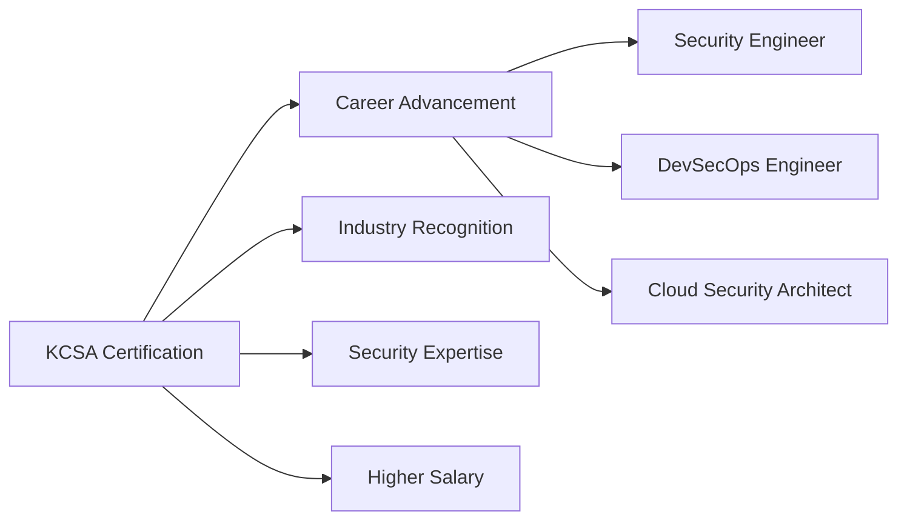

# 🛡️ KCSA Study Notes - Complete Exam Preparation Guide

<div align="center">


**🎯 Your Complete Guide to Kubernetes Certified Security Associate Success**

</div>

---

## 🌟 Welcome to Your KCSA Journey!

This repository is your **one-stop resource** for mastering the **Kubernetes Certified Security Associate (KCSA)** exam. Whether you're a security professional entering the cloud-native world or a Kubernetes practitioner expanding into security, this guide will take you from zero to exam-ready!

### 🎯 What Makes This Guide Special?

| Feature | Description |
|---------|-------------|
| 📚 **Complete Coverage** | All 6 official domains with exact exam weightings |
| 🔍 **Deep Dive Content** | Beyond surface-level - real understanding |
| 💻 **Hands-On Labs** | Practice exercises for every concept |
| 📖 **Official References** | Direct links to Kubernetes documentation |
| 🎨 **Visual Learning** | Diagrams, code examples, and clear formatting |
| 🆓 **Community Driven** | Open source and continuously updated |

---

## 🎯 KCSA Exam at a Glance

> **The KCSA validates your foundational knowledge of cloud-native security technologies and prepares you for advanced Kubernetes security certifications.**

### 📊 Exam Specifications

<table>
<tr>
<td>

**📋 Format & Structure**
- 🎯 **Type:** Multiple Choice
- ⏱️ **Duration:** 90 minutes  
- 💰 **Cost:** $250 USD (includes 1 free retake)
- 🎯 **Passing Score:** 75%
- 📅 **Validity:** 3 years
- 🌐 **Delivery:** Online, proctored

</td>
<td>

**🎓 Prerequisites**
- Basic Kubernetes knowledge
- Understanding of containerization
- Familiarity with Linux/command line
- Basic security concepts
- Cloud computing fundamentals

</td>
</tr>
</table>

### 🏆 Why Get KCSA Certified?



---

## 📚 Complete Study Roadmap

> **Follow this structured path to master all 6 KCSA domains with confidence!**

<div align="center">

### 🗺️ Your Learning Journey

```
Start Here → Domain 1 → Domain 2 → Domain 3 → Domain 4 → Domain 5 → Domain 6 → Exam Ready! 🎉
```

</div>

### 📖 Domain Breakdown with Study Time Estimates

<table>
<thead>
<tr>
<th>Domain</th>
<th>Weight</th>
<th>Study Time</th>
<th>Difficulty</th>
<th>Key Focus</th>
</tr>
</thead>
<tbody>

<tr>
<td>

### [🌐 1. Cloud Native Security Overview](./01-cloud-native-security/README.md)
**Foundation Layer** - Start here!

</td>
<td>

**14%** 
📊 ~11 questions

</td>
<td>

⏱️ **8-12 hours**
*Beginner friendly*

</td>
<td>

🟢 **Beginner**
Great starting point

</td>
<td>

- 4Cs Security Model
- Cloud Provider Security  
- Compliance Frameworks
- Container Image Security

</td>
</tr>

<tr>
<td>

### [🔧 2. Cluster Component Security](./02-cluster-component-security/README.md)
**Core Infrastructure** - Critical knowledge!

</td>
<td>

**22%**
📊 ~18 questions

</td>
<td>

⏱️ **15-20 hours**
*Most important domain*

</td>
<td>

🟡 **Intermediate**
Requires K8s knowledge

</td>
<td>

- API Server Hardening
- etcd Security
- Kubelet Configuration
- Network Security

</td>
</tr>

<tr>
<td>

### [🛡️ 3. Security Fundamentals](./03-security-fundamentals/README.md)
**Essential Skills** - Daily operations!

</td>
<td>

**22%**
📊 ~18 questions

</td>
<td>

⏱️ **15-20 hours**
*Hands-on practice needed*

</td>
<td>

🟡 **Intermediate**
Practice intensive

</td>
<td>

- RBAC & Authentication
- Pod Security Standards
- Secrets Management
- Network Policies

</td>
</tr>

<tr>
<td>

### [🎯 4. Threat Modeling](./04-threat-model/README.md)
**Security Mindset** - Think like an attacker!

</td>
<td>

**16%**
📊 ~13 questions

</td>
<td>

⏱️ **10-15 hours**
*Conceptual understanding*

</td>
<td>

🟠 **Advanced**
Requires security thinking

</td>
<td>

- STRIDE Framework
- Attack Vectors
- MITRE ATT&CK
- Risk Assessment

</td>
</tr>

<tr>
<td>

### [🏗️ 5. Platform Security](./05-platform-security/README.md)
**Advanced Topics** - Enterprise focus!

</td>
<td>

**16%**
📊 ~13 questions

</td>
<td>

⏱️ **12-18 hours**
*Tool-heavy domain*

</td>
<td>

🟠 **Advanced**
Many tools to learn

</td>
<td>

- Supply Chain Security
- Service Mesh (Istio)
- PKI & Certificates
- Admission Controllers

</td>
</tr>

<tr>
<td>

### [📋 6. Compliance & Frameworks](./06-compliance-frameworks/README.md)
**Governance** - Enterprise requirements!

</td>
<td>

**10%**
📊 ~8 questions

</td>
<td>

⏱️ **6-10 hours**
*Policy focused*

</td>
<td>

🟢 **Beginner**
Mostly conceptual

</td>
<td>

- PCI DSS, HIPAA, SOC2
- Automation Tools
- Policy as Code
- Audit & Compliance

</td>
</tr>

</tbody>
</table>

### 🎯 Quick Navigation

<div align="center">

| 🚀 **Quick Start** | 🔧 **Core Skills** | 🎯 **Advanced** | 📚 **Resources** |
|:---:|:---:|:---:|:---:|
| [Setup Lab Environment](#-getting-started) | [Security Fundamentals](./03-security-fundamentals/README.md) | [Threat Modeling](./04-threat-model/README.md) | [Official Docs](#-official-resources) |
| [Cloud Native Basics](./01-cloud-native-security/README.md) | [Cluster Security](./02-cluster-component-security/README.md) | [Platform Security](./05-platform-security/README.md) | [Practice Labs](#-practice-environment) |

</div>

---

## 🚀 Getting Started - Your First Steps

### ✅ Prerequisites Checklist

Before diving into KCSA preparation, ensure you have these foundations:

<table>
<tr>
<td width="50%">

#### 🎯 **Essential Knowledge**
- [ ] Basic Kubernetes concepts (Pods, Services, Deployments)
- [ ] Container fundamentals (Docker basics)
- [ ] Linux command line proficiency
- [ ] Basic networking concepts
- [ ] Security principles overview

</td>
<td width="50%">

#### 🛠️ **Technical Skills**
- [ ] YAML file editing
- [ ] kubectl command usage
- [ ] Basic troubleshooting
- [ ] Text editor proficiency (vim/nano)
- [ ] Git basics (optional but helpful)

</td>
</tr>
</table>

### 🏗️ Practice Environment Setup

> **💡 Pro Tip:** Hands-on practice is crucial for KCSA success. Set up your lab environment first!

#### Option 1: Minikube (Recommended for Beginners)

```bash
# 🚀 Quick Minikube Setup
# Install Minikube (visit https://minikube.sigs.k8s.io/docs/start/)

# Start your cluster
minikube start --driver=docker --memory=4096 --cpus=2

# Enable essential addons
minikube addons enable metrics-server
minikube addons enable dashboard
minikube addons enable ingress

# Verify installation
kubectl cluster-info
kubectl get nodes

# 🎯 Test with security-focused deployment
kubectl create deployment security-test \
  --image=nginx:1.21-alpine \
  --replicas=2

# Check deployment
kubectl get pods -l app=security-test
```

#### Option 2: Kind (Kubernetes in Docker)

```bash
# 🐳 Kind Setup for Advanced Users
# Install kind (visit https://kind.sigs.k8s.io/docs/user/quick-start/)

# Create cluster with custom config
cat <<EOF | kind create cluster --config=-
kind: Cluster
apiVersion: kind.x-k8s.io/v1alpha4
name: kcsa-lab
nodes:
- role: control-plane
  kubeadmConfigPatches:
  - |
    kind: InitConfiguration
    nodeRegistration:
      kubeletExtraArgs:
        node-labels: "ingress-ready=true"
  extraPortMappings:
  - containerPort: 80
    hostPort: 80
    protocol: TCP
  - containerPort: 443
    hostPort: 443
    protocol: TCP
- role: worker
- role: worker
EOF

# Verify multi-node setup
kubectl get nodes
```

#### Option 3: Cloud Provider (Production-like)

<details>
<summary>🌩️ <strong>Click to expand cloud setup options</strong></summary>

**Google Cloud (GKE)**
```bash
# Create GKE cluster with security features
gcloud container clusters create kcsa-cluster \
  --zone=us-central1-a \
  --num-nodes=3 \
  --enable-network-policy \
  --enable-pod-security-policy \
  --enable-shielded-nodes \
  --machine-type=e2-medium
```

**AWS (EKS)**
```bash
# Create EKS cluster
eksctl create cluster \
  --name kcsa-cluster \
  --region us-west-2 \
  --nodegroup-name workers \
  --nodes 3 \
  --nodes-min 1 \
  --nodes-max 4 \
  --managed
```

**Azure (AKS)**
```bash
# Create AKS cluster
az aks create \
  --resource-group kcsa-rg \
  --name kcsa-cluster \
  --node-count 3 \
  --enable-addons monitoring \
  --enable-network-policy \
  --generate-ssh-keys
```

</details>

### 🧪 Verify Your Setup

Run this comprehensive verification script:

```bash
#!/bin/bash
# 🔍 KCSA Lab Environment Verification

echo "🔍 Verifying KCSA Lab Environment..."

# Check cluster access
echo "✅ Checking cluster access..."
kubectl cluster-info --request-timeout=10s

# Check node status
echo "✅ Checking nodes..."
kubectl get nodes -o wide

# Test RBAC (should fail without proper permissions)
echo "✅ Testing RBAC..."
kubectl auth can-i create pods --as=system:serviceaccount:default:default

# Check security-related resources
echo "✅ Checking security resources..."
kubectl get psp,networkpolicies,secrets --all-namespaces

# Test network connectivity
echo "✅ Testing network..."
kubectl run test-pod --image=busybox --rm -it --restart=Never -- nslookup kubernetes.default

echo "🎉 Environment verification complete!"
```

### 📖 Study Plan Recommendations

<div align="center">

#### 🗓️ **Suggested Study Timeline**

</div>

| Week | Focus Area | Time Investment | Key Activities |
|------|------------|----------------|----------------|
| **Week 1-2** | [Cloud Native Foundations](./01-cloud-native-security/README.md) | 10-15 hours | Setup lab, learn 4Cs model, basic security |
| **Week 3-4** | [Cluster Components](./02-cluster-component-security/README.md) | 15-20 hours | Deep dive into K8s security, hands-on labs |
| **Week 5-6** | [Security Fundamentals](./03-security-fundamentals/README.md) | 15-20 hours | RBAC, Pod Security, Network Policies |
| **Week 7** | [Threat Modeling](./04-threat-model/README.md) | 10-12 hours | Security mindset, attack vectors |
| **Week 8** | [Platform Security](./05-platform-security/README.md) | 12-15 hours | Advanced tools, supply chain |
| **Week 9** | [Compliance](./06-compliance-frameworks/README.md) | 8-10 hours | Frameworks, automation, policies |
| **Week 10** | **Exam Preparation** | 10-15 hours | Practice tests, review, final prep |

> **💡 Flexible Timeline:** Adjust based on your background. Security professionals might skip Week 1, while K8s beginners might need extra time on Weeks 3-4.</div>

## 📖 How to Use This Guide

1. **Start with the Exam Overview** to understand the structure and requirements
2. **Follow the domains in order** - each builds upon previous knowledge
3. **Complete practice exercises** in each section
4. **Use additional reading** to deepen understanding
5. **Review regularly** and test your knowledge

## 🔗 Official Resources

- [CNCF KCSA Certification Page](https://www.cncf.io/training/certification/kcsa/)
- [Official KCSA Curriculum](https://github.com/cncf/curriculum/blob/master/KCSA%20Curriculum.pdf)
- [Kubernetes Security Documentation](https://kubernetes.io/docs/concepts/security/)

## 🤝 Contributing

Contributions are welcome! Please:
1. Fork the repository
2. Create a feature branch
3. Make your changes
4. Submit a pull request

## 📄 License

This study guide is provided under the MIT License. See [LICENSE](LICENSE) for details.

## ⚠️ Disclaimer

This study guide is created by the community and is not officially endorsed by the CNCF. Always refer to the official CNCF documentation and curriculum for the most current exam requirements.

---

**Good luck with your KCSA exam preparation! 🎉**

*Last updated: June 2025*
